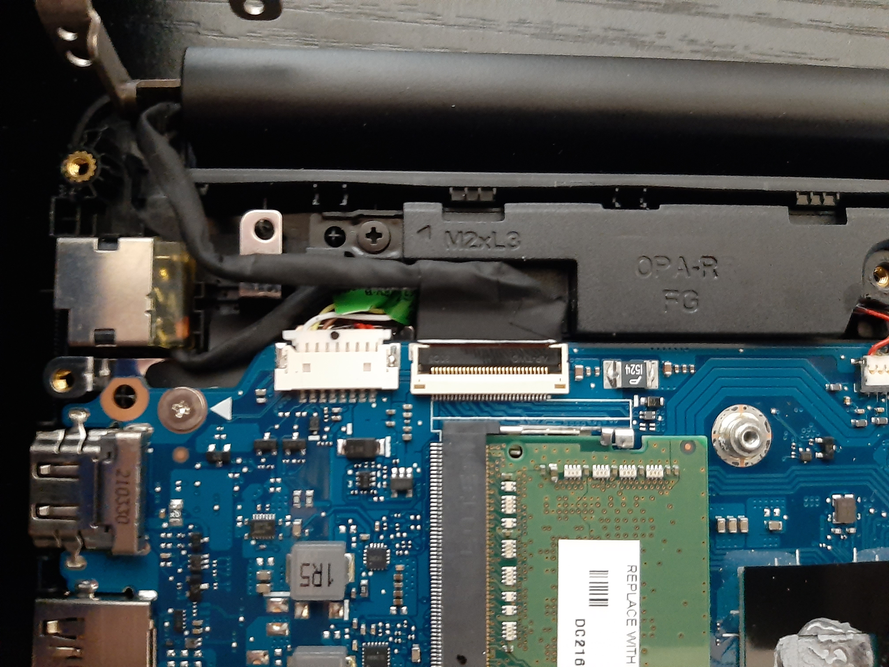
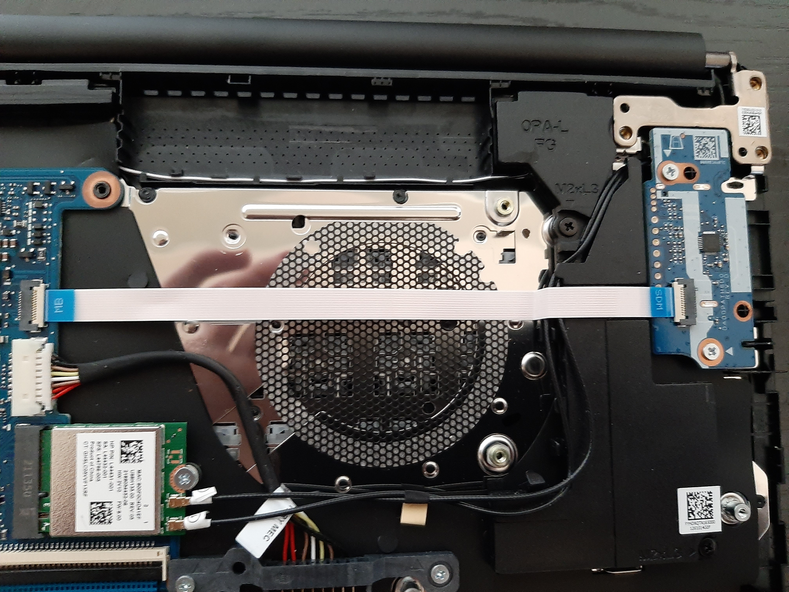
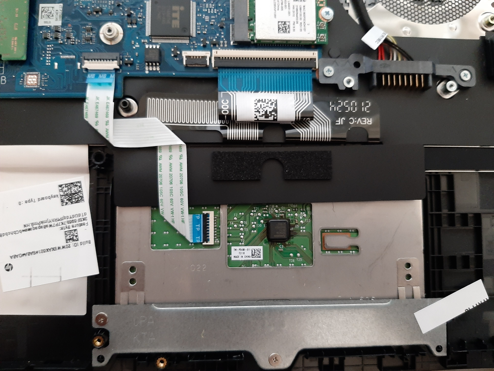

<h1 align="center">
 
  HP 14dq0001dx Teardown
   
</h1>

<h4 align="center">Teardown images of HP laptop 14dq0001dx</h4>

  <a href="#top-view">Top View</a> •
  <a href="#top-view-labeled">Top View Labeled</a> •
  <a href="#monitor-cable">Monitor Cable</a> •
  <a href="#removed-heatsink">Removed Heatsink</a> •
  <a href="#trackpad--keyboard">Trackpad & Keyboard</a> •
  <a href="#walkthrough">Walkthrough</a> •

## Top View

## Top View Labeled

## Monitor Cable

## Removed Heatsink

## Trackpad & Keyboard

## walkthrough
