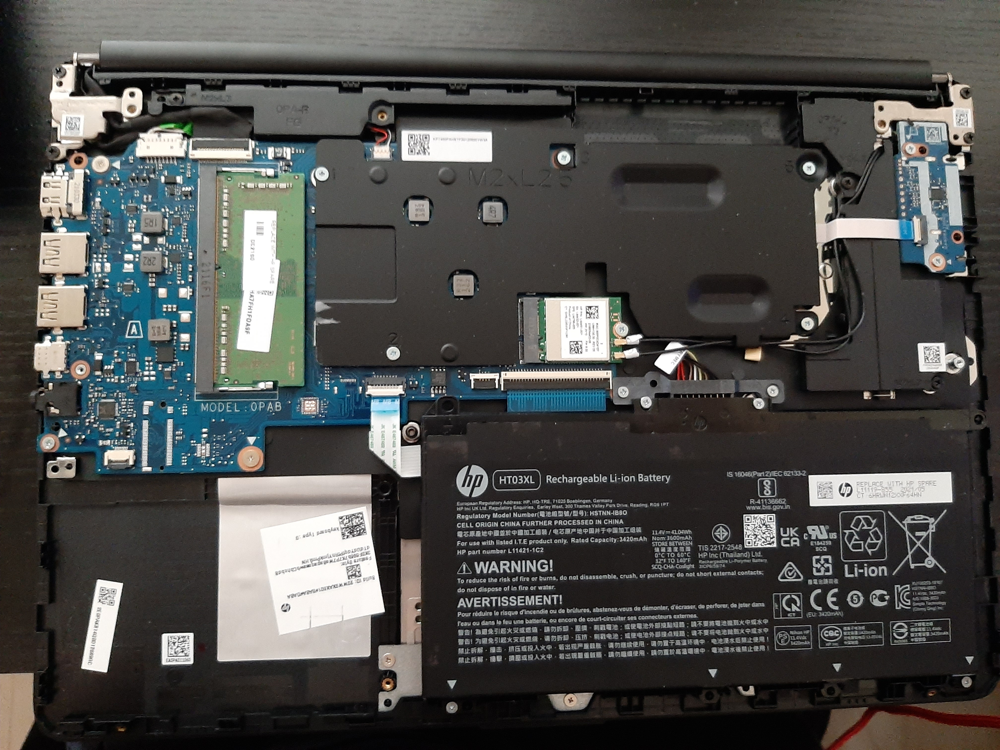

<h1 align="center">
 
  HP 14dq0001dx Teardown
   
</h1>

<h4 align="center">Teardown images of HP laptop 14dq0001dx</h4>
<h5 align="center">I was going to turn this old laptop into a server anyways so decided to take a look inside</h5>

  <a href="#top-view">Top View</a> •
  <a href="#top-view-labeled">Top View Labeled</a> •
  <a href="#monitor-cable">Monitor Cable</a> •
  <a href="#monitor-arms">Monitor Arms</a> •
  <a href="#removed-heatsink">Removed Heatsink</a> •
  <a href="#trackpad--keyboard">Trackpad & Keyboard</a> •
  <a href="#ribbon-connections">Ribbon Connections</a>
  <a href="#walkthrough">Walkthrough</a>

## Top View

## Top View Labeled

## Monitor Cable

## Monitor Arms

## Removed Heatsink

## Trackpad & Keyboard

## Ribbon Connections

## Walkthrough

This is not the definite way to tear down this laptop; it's just the route I took for the purposes I need it.

- [ ] Remove the battery by unscrewing it
- [ ] Discharge any capicitors by holding the on button for at least 5 seconds
- [ ] Remove the heat sink
- [ ] Unplug the ribbon cable connecting the SD Reader and Power button sister board from the motherboard
- [ ] Unplug the two cables from the wireless adapter card
- [ ] To detach the monitor screen from the rest of the laptop, unscrew the arms in both corners and unplug the monitor ribbon cable (make sure the adapter card is also unplugged since the antennas are located in the screen)
- [ ] The ribbon cables for the trackpad and keyboard are hidden underneath the battery
